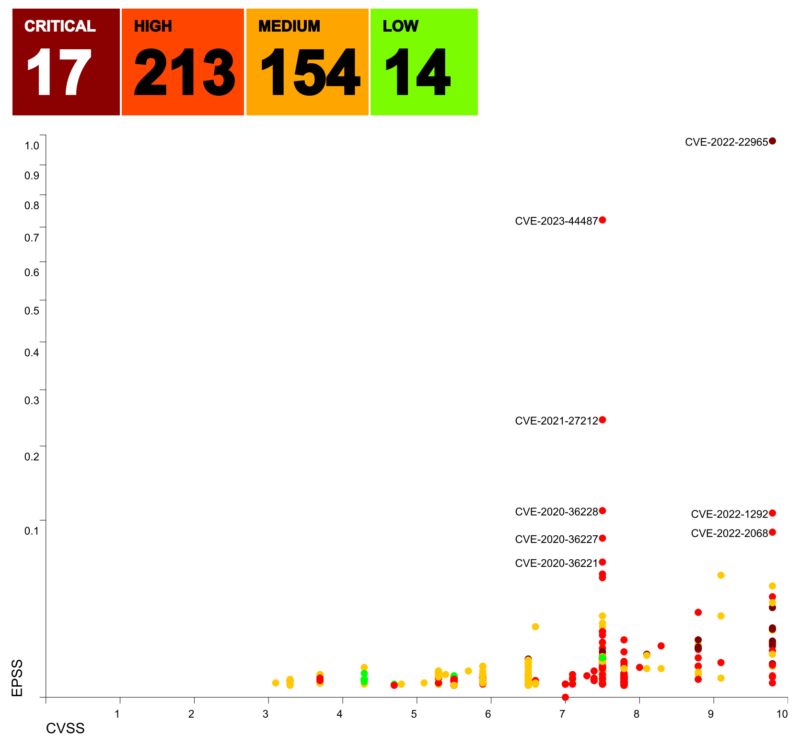
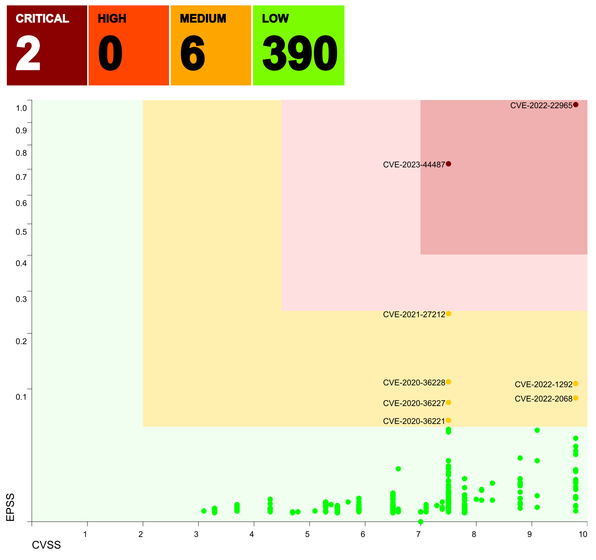
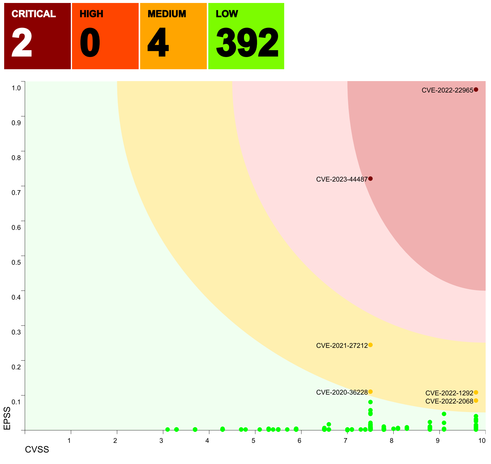

# TrivySummary

TrivySummary summarises Trivy scan JSON output for reporting purposes. Package vulnerabilities are collapsed down to the respective CVE, and headline counts of vulnerabilities at different [priorities](#priority-model).
As well as the vendor severity and CVSS v3 score provided by Trivy, EPSS scores can also be retrieved, allowing the exploitability and severity of all vulnerabilities to be graphed and prioritised.

The tool has a number of options to aid reporting.
* It can take a single Trivy scan JSON file and summarise it to PDF or to JSON
* It can take two Trivy scan JSON files for the same logical component, taken at different points in time and compare them, again summarising to PDF or JSON

It also can aid CI/CD pipelines by exiting with an error if there are open vulnerabilities at a given priority or above (e.g. fail if at least one CRITICAL or HIGH vulnerability has been found).

## Usage

Requires Java Runtime Environment 17 or higher. Run application from the _bin_ folder (on Windows, use _trivysummary.bat_ not _trivysummary_).

To summarise a single Trivy JSON file, use the form:

```
trivysummary <trivyScanOutput>.json <args>
```

To summarise and compare two Trivy JSON files for the same component, use the form:

```
trivysummary <previousTrivyOutput>.json <latestTrivyOutput>.json <args>
```

For scan dates, this application relies on the createdAt property added by
later versions of Trivy (since v0.48.0).

### Arguments

```
  --help
    Displays this help message

  --title=...
    Sets a report title. If unset, a default title is used containing
    the input file path(s) provided

  --outputFile=...
    The required output file name. If the filename ends in .pdf then the
    output is a PDF report. If not, a JSON format is used. Defaults to
    "trivysummary.pdf" in the current working directory.

  --failPriorityThreshold=...
    The priority threshold at or above which any open vulnerabilities
    will cause this app to return an error (returns -1, rather than 0).
    Must be one of LOW, MEDIUM, HIGH or CRITICAL.
    If unset, an error won't be returned for any set minimum priority.

  --whitelist=...
    If set, one or more files in JSON format listing CVEs which should be
    whitelisted in the output. You can specify this argument multiple times
    if you wish to load multiple whitelists

  --treatmentPlan=...
    If set, the JSON format treatment plan so that progress can be reported
    and tracked. Only one treatment plan may be specified.

  --offline
    If set, TrivySummary will not attempt to access EPSS scores to assess
    the exploitability of CVEs. This will bypass graphing and prioritisation
    but is useful if using this tool from airgapped environments.

  --priorityModel=...
    If this is set, TrivySummary will load the specified priority model
    JSON file.
    If this isn't set, the model defaults to SEVERITYONLY, i.e. that
    the priority is the same as the vendor severity.

  --useTodayForEPSSQuery
    If this is set, TrivySummary will request EPSS scores for today and
    not for the date of the scan (the default).
    Is ignored if in offline mode
```

### Whitelisting

This application supports whitelisting vulnerabilities, based on supplying one or more JSON files, each
in the format specified below.

Whitelisting a CVE causes it to be removed from the list of open vulnerabilities reported by Trivy and 
to exclude it from consideration as to the fail threshold (e.g. if the fail threshold is set to CRITICAL
and you whitelist the only open CRITICAL CVE, then the application will not report this as an error).

Each JSON file is an array of whitelisting entries. Each whitelisting entry has the following properties:

* vulnerabilityID _(mandatory)_
  
  The CVE reference.

* reason _(mandatory)_
 
  The justification for why this can be whitelisted, i.e. does not affect your code. Has it been confirmed
  as a false positive? Does your code feature-control this component to disable the exposure? etc.

* nextReviewDate _(mandatory)_

  A date in yyyy-MM-dd format. Must be specified. If you are creating a new item for immediate review
  (e.g. to allow your code to build until you have assessed whether you need to remediate before
  publication, then set this to today's date or a date in the past).

* approvalDate _(optional)_

  The date on which this vulnerability was reviewed, in yyyy-MM-dd format. Both the approvalDate and
  approvedBy fields must be set for TrivySummary to recognise this as having been approved. The
  approvalDate must not be in the future, or else TrivySummary will not recognise this as having been
  approved.

* approvedBy _(optional)_

  The name of the approver. Both the approvalDate and approvedBy fields must be set for TrivySummary
  to recognise this whitelisting as having been approved.

For sample JSON to whitelist [see here](src/test/resources/sampleWhitelist1.json)

### Treatment plan

This application supports a fuller reporting structure of progress by specifying a treatment plan which
will be merged into any generated PDF report.

The format of a treatment plan is as follows:

* ticketSystemURLTemplate _(mandatory)_

  A templated URL form for your ticketing system with the ticket reference replaced by _{ticketId}_.
  For example, a typical Jira configuration might be `https://myjirasystem.mydomain.com/browse/{ticketId}`

* defaultNoteText _(mandatory, but may be left blank)_

  A default note to be displayed in the event that a vulnerability is detected which does not match a note or treatment

* treatments _(mandatory)_

  A list of treatments currently in the ticketing system, matching one or more CVE references, and/or one or more artefact names

* notes _(mandatory)_

  A list of notes which may apply, matching one or more CVE references, and/or one or more artefact names.
  The intent here is to be able to give clarity as to the agreed approach where a ticket would be inappropriate (e.g. where no fixes are available yet but a patch release is expected imminently, a note
  to explain this and how this is tracked might be more appropriate than a treatment linked to a ticket).

For a sample treatment plan JSON [see here](src/test/resources/testapp/testAppTreatments1.json)

### <a id="epss"/>Better remediation prioritisation through EPSS (exploitability scoring)

The open source version of [Trivy](https://github.com/aquasecurity/trivy) only supports assessment against
severity (more properly, emphasising vendor assessment of severity). There are other means of scoring CVEs
including [EPSS](https://www.first.org/epss/), the Exploit Prediction Scoring System.

TrivySummary will, by default, add EPSS scores to each CVE (unless overridden by the _--offline_ flag) and
graph the results. CVEs which are of the highest combination of CVSS and EPSS will be labelled.

In addition, through the use of a custom [priority model](#priority-model) CVEs with both CVSS and EPSS 
scores can be more effectively prioritised than by one where only severity is considered..

**Please note** that a CVE's marked severity and CVSS score may not correspond, as vendors such as RedHat
often set a different vendor severity from that implied by the CVSS due to their assessment of the wider 
circumstances and how software is deployed and used. Trivy takes this into account and prefers the vendor
assessment (see [Severity Selection](https://aquasecurity.github.io/trivy/dev/docs/scanner/vulnerability/)
section).

## <a id="priority-model"/>Priority Model

Providing that TrivySummary is not used in _--offline_ mode, support for a number of different priority
models are provided.

### Severity-only

The default mode, without specifying a priority model, is Severity-only, where the only prioritisation
is, like the open source Trivy product itself, set by the vendor severity (CRITICAL, HIGH, MEDIUM, LOW).

A sample graph might appear as follows:



Whilst simple in concept, the downside is that it doesn't really assist developers in triaging and 
prioritising vulnerabilities as each vendor severity may, or may not, align with the expectations
of CVSS v3 scores, let alone factor in the exploitability of the vulnerability using EPSS scores.

### Rectangular

In this model type, CRITICAL, HIGH and MEDIUM priority CVEs may be identified by setting minimum CVSS
and EPSS threshold for each priority and TrivySummary sets a priority purely on the basis of whether 
each vulnerability is above each threshold. This makes each priority appear as a rectangle, as in
the following example:



Note the colour grading now and the fact that this is a much clearer model. Also note the effective
triaging this allows of vulnerabilities (compare numbers of CRITICAL, HIGH and MEDIUM CVEs with the
Severity-only model above).

It's clear advantages are that it improves the signal-to-noise ratio of assessing vulnerabilities and
is a very easy model to describe to stakeholders.

It does, however, make the bottom left hand corner of each rectangle be a bit of a potential trap
for borderline cases for vulnerabilities, potentially making them appear higher priority than they
are. This can be mitigated by simply keeping thresholds to align with the standard model (where it
exists) for assigning a textual marker (e.g. CVSS scores 9.0 and above are CRITICAL) but this could
have the opposite effect in having a smaller window than is actually desired.

To solve for this, the elliptical priority model was developed, as follows.

### Elliptical

This priority model is very similar to the above rectangular model but where each set of priority
CVSS/EPSS threshold values describe the major and minor axes of an ellipse, and where the standard
equation of an ellipse describes the bounds of which priority a CVE belongs. This is best shown in 
the following example:



This more accurately models the desire to address those vulnerabilities which are closest to 
CVSS=10.0 / EPSS=1.0 first. 

One big advantage of this model is that it promotes a more generous view of severity to be used,
setting a much lower CVSS threshold than a severity-only assumed model (e.g. CVSS scores 9.0 and
above are CRITICAL) would dictate but without adversely affecting the overall risk threshold.

As such, the author highly recommends the Elliptical priority model above use of the 
others but it is, of course, a choice for the user.

### Specifying a priority model

The default priority mode is Severity-only, as the others require setting some custom thresholds.
To override this behaviour, the _--priorityModel=..._ attribute is used to point to a JSON file
containing the priority model.

Example files for [Severity-only](src/test/resources/samplePriorityModelSeverityOnly.json),
[Rectangular](src/test/resources/samplePriorityModelRectangular.json) and
[Elliptical](src/test/resources/samplePriorityModelElliptical.json) models are provided.

Each JSON file is simple structure with the following fields as follows:

* type _(mandatory)_
  
  The priority model type. One of SEVERITYONLY, RECTANGULAR and ELLIPTICAL

* criticalPriorityThresholds _(optional)_
 
  Only has meaning in RECTANGULAR and ELLIPTICAL models. A complex type with two attributes:

  * minimumCVSS _(mandatory)_
  * minimumEPSS _(mandatory)_
    
    The CVSS and EPSS scores which the CVE is tested against. If the CVE has scores that are both
    &gt;= their respective minimum thresholds configured here, then the CVE can be considered to be
    at this priority

* highPriorityThresholds _(optional)_
 
  Only has meaning in RECTANGULAR and ELLIPTICAL models. A complex type with the same two attributes
  as criticalPriorityThresholds.

* mediumPriorityThresholds _(optional)_
 
  Only has meaning in RECTANGULAR and ELLIPTICAL models. A complex type with the same two attributes
  as criticalPriorityThresholds.

Note that CVEs are assessed in the order CRITICAL, then HIGH, then MEDIUM to see if they meet the thresholds.
It is possible to omit thresholds (e.g. just to have CRITICAL and HIGH) but, of course, there is no logic in
omitting all the priority thresholds. CVEs that do not meet the thresholds for any of the above are 
categorised as LOW priority.